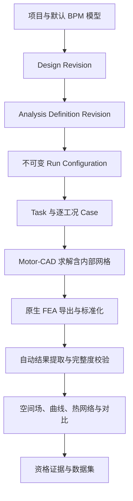

# MotorCAD Studio V0.52.1 全量一致性修复审计

## 1. 审计结论

V0.52.1 已完成当前源码包内可闭合问题的全量修复。审计范围覆盖默认模型入口、设计可视化、Analysis Definition、Run Configuration、Task/Case、多工况执行、Motor-CAD 原生 FEA 证据、自动结果提取、资格晋级、结果浏览器、诊断包与响应式排版。

本次确认并修复 27 个问题或同源风险。离线回归为 **264 passed**；Python 编译、全部前端 JavaScript 语法、YAML/JSON 解析和 V0.52.1 发布合同均通过。当前环境没有浏览器二进制，也没有 Windows + Motor-CAD 2026R1，因此像素级浏览器渲染与原生工作站资格单独列入验收边界。

## 2. 当前工程流程

系统继续承担 Motor-CAD Scripting/Automation 的可视化封装。独立 Scripting 页面不进入产品主流程；批量分析、DOE、寻优和结果提取通过版本化 UI 与任务引擎执行。

## 3. 已修复问题清单

| # | 问题 | 影响 | V0.52.1 修复 | 验证 |
|---:|---|---|---|---|
| 1 | 三栏与旧网格在中等屏宽挤压主画布 | 电机图过小、参数难读 | 主工作区使用弹性列；1599/1180/820 px 分级折叠 | CSS 合同测试 |
| 2 | 径向、轴向、绕组、槽内图高度不足 | 结构细节不可辨认 | 画布提升至 500–660 px，并在窄容器保持 390–440 px | 静态布局检查 |
| 3 | 旧页面存在 8–10 px HTML 文本 | 高级页面可读性不一致 | 增加 HTML 小字、表格、按钮和输入控件全局可读性下限 | CSS 扫描 |
| 4 | 默认模板进入后的“电机模型”语义不清 | 用户不知道该区作用 | 明确为“本次计算引用的已保存 Design Revision”，并调整上下布局 | 前端契约测试 |
| 5 | 首次创建 Analysis Definition 仍使用简化输入 | 首版分析缺少配方参数 | 首次创建与后续 Revision 统一进入专用配方编辑器 | JS 合同测试 |
| 6 | 多工况编辑只保留首个工况 | 批量定义保存后执行丢失 | 支持工况行增删、逐行校验和最多 5000 Case | API 端到端测试 |
| 7 | Task 只执行 Analysis Definition 第一个工况 | 运行结果与定义不一致 | `scenario_matrix` 逐 Case 落库、哈希、执行和回读 | 双工况端到端测试 |
| 8 | Task 未冻结 Analysis Revision 来源 | 难以追踪配方版本 | 保存 `analysis_definition_revision_id`，校验项目、设计和配方归属 | Run Configuration 测试 |
| 9 | 派生 `native_fea` 快照覆盖新 UI 值 | 新 Revision 的 FEA 开关可能无效 | 可编辑平面字段优先；每次重写派生快照及合同哈希 | FEA 计划单测 |
| 10 | 字符串 `false` 被当作真值 | FEA/原生画面关闭失败 | 布尔字符串显式解析；列表字符串按逗号/分号规范化 | 单元测试 |
| 11 | required 配方可被 optional 策略降级 | 必需 FEA 缺失仍可能通过 | 配方要求与用户策略联合判定，required 配方保持阻断 | 单元测试 |
| 12 | optional FEA 缺失会误阻断资格 | 可选证据影响主结果 | optional 缺失标为 PARTIAL，主结果资格可继续 | 单元测试 |
| 13 | 旧结果缺合同仍可晋级 Level 4 | 资格证据不可信 | 仅接受当前提取合同和 FEA 合同均显式通过的真实结果 | 资格回归测试 |
| 14 | 旧缓存结果可被新任务复用 | 新规则被历史结果绕过 | Motor-CAD 缓存复用要求两份当前合同显式通过 | 任务回归测试 |
| 15 | Result Viewer 对缺失合同默认放行 | 历史 Case 显示完整 | 从当前结构化结果和证据重新计算合同；运行中显示 PENDING | 结果合同测试 |
| 16 | 仅有连接列名称就标记网格场 | 点云被误称为网格云图 | 只有实际 `mesh_edges` 才标记 NATIVE_MESH_FIELD | 证据层级测试 |
| 17 | 字段下拉除 Pt 外均回退到 B | J、JEddy、应力等选择无效 | 所有已导出字段按真实字段 ID 读取 | 前端回归测试 |
| 18 | 求解阶段由最终结果推测 | 过程状态失真 | 七阶段状态取自 `case_stages` 实际记录 | 前端合同测试 |
| 19 | 多个旧阶段会同时保持 RUNNING | 监控看似并行执行 | 新阶段开始时关闭前一阶段；失败状态归一为 FAILED/TIMEOUT/CANCELLED | 任务引擎回归 |
| 20 | Motor-CAD 内部网格与求解被伪拆分 | 暗示可观测性超出 API | 合并为“求解（含网格）”，明确公共 API 权威边界 | 发布验证 |
| 21 | 云图色标按帧漂移且 null 被当成 0 | 帧间比较与范围失真 | 默认全帧色标；空值过滤；允许切换当前帧范围 | JS 语法与合同测试 |
| 22 | 快速拖动帧可能被旧响应覆盖 | 显示错帧 | `AbortController`、请求序号和 Case 身份三重防护 | 前端合同测试 |
| 23 | 缺少区域筛选与空间探针 | 工程定位能力不足 | 增加区域过滤与最近原生点探测 API/UI | API/前端合同测试 |
| 24 | 机械应力导出未进入结构化结果 | 结果合同看不到应力场 | 标准化 Stress 映射为 `stress_field` 引用 | 提取合同测试 |
| 25 | 当前 Case 热网络使用批次默认工况 | 多工况温度边界显示错误 | 结果页统一读取 Case 自己的 `scenario_json` | 结果服务回归 |
| 26 | 不完整重试次数重复累加，旧产物可能干扰 | Attempt 和当前证据失真 | Attempt 仅在真正执行时增加；运行中隐藏历史产物 | 重试/结果回归 |
| 27 | 诊断包缺 FEA/提取合同与可视化样本 | 难以定位结果缺失和云图问题 | 增加 Case 合同摘要、提取清单、FEA 清单、首末帧和 512 KiB 原始样本 | 诊断包回归测试 |

## 4. 与 Motor-CAD 工作流对齐后的完成度

完成度分为“Studio 源码实现”和“目标工作站原生结果验证”。前者可由当前环境确认，后者必须使用真实许可证、目标模板与 Motor-CAD 2026R1。

| 领域 | Studio 实现 | 离线验证 | 目标工作站状态 | 说明 |
|---|---:|---:|---|---|
| 默认模型与多机型入口 | 100% | 100% | 待逐机型结果验证 | 9 类机型入口；默认 BPM 自动创建 |
| 设计多视图与参数编辑 | 100% | 100% | 待原生参数目录结果验证 | 径向、轴向、绕组、槽内、材料、证据、比较 |
| Analysis Definition | 100% | 100% | 待方法签名结果验证 | 17 配方、5 模块、逐工况编辑与版本化 |
| Run Configuration/追溯 | 100% | 100% | 不依赖原生求解 | Design/Analysis/Scenario/Solver/Output 全部冻结 |
| Task/Case 批量执行 | 100% | 100% | 待 20/100/500 Case 耐久 | 多工况逐 Case、缓存、取消、恢复、定向重试 |
| 原生 FEA 管线 | 100% | 100% | 待真实导出结果验证 | 导出、归一化、帧、区域、色标、探针、证据门 |
| 自动结果提取 | 94% | 100% | 两个表格映射待实机 | 15/17 配方达到 RESULT_VISIBLE；2 项保持 CONFIGURABLE |
| 结果可视化 | 100% | 100% 静态 | 待浏览器像素与原生场结果验证 | 空间场优先，JSON 下沉到诊断/API |
| 资格与缓存安全 | 100% | 100% | 当前无本机 Level-4 证据 | 缺合同、缺 FEA、缺必需结果均不晋级 |
| 诊断与可支持性 | 100% | 100% | 待真实故障包演练 | 已包含运行、模型、提取、FEA、资格和样本 |

### 当前配方能力

- 17 个分析配方均可在相应机型模块中声明与配置。
- 15 个配方达到 `RESULT_VISIBLE` 源码能力。
- `emag_multi_force` 仍缺 `force_position_table` 的真实 Motor-CAD 表格映射。
- `lab_test_performance` 仍缺 `lab_test_performance_table` 的真实 Motor-CAD 表格映射。
- 当前环境未产生真实工作站资格，因此不会显示任何伪造的 `NATIVE_QUALIFIED`。

## 5. 原生实时性的准确边界

页面在求解期间实时显示 Task/Case 阶段、进度、Worker/资源租约和原生画面事件。结构化空间场帧来自 `save_fea_data` 完成后的真实导出。Motor-CAD 公共计算调用在内部完成网格与求解，Studio 无法在该阻塞调用内部持续取得每次迭代的网格场。本版本明确显示“求解（含网格）”，不会用插值或示意数据伪装求解中间场。

如果未来目标版本提供非阻塞求解回调或逐步场导出 API，可在现有 `fea-stream` 与帧合同上增加真正的求解中场帧，无需改变结果数据模型。

## 6. 仍需真实工作站完成的验收

以下项目属于外部验收，不属于当前源码缺陷：

1. 在 Windows + Motor-CAD 2026R1 上确认 17 个配方的方法签名、许可证与模型上下文。
2. 为 `force_position_table` 和 `lab_test_performance_table` 采集真实导出样本并登记版本化映射。
3. 按 BPM/BPMOR/IM/IM1PH/SYNC/SYNCREL/SRM/PMDC/CLAW 逐机型运行代表性案例。
4. 对 B、Pt、J、JEddy、Stress、Displacement 的坐标、单位、区域、帧数和极值做结果验证。
5. 运行 20/100/500 Case 耐久，记录许可证占用、Worker 回收、RSS 高水位、超时和恢复证据。
6. 在 1920×1080、2560×1440、150% Windows 缩放及窄屏浏览器完成像素级可读性检查。
7. 使用真实失败任务导出诊断包，确认 Motor-CAD MessageLogs、FEA 清单、提取合同和根因排序足以支持现场定位。

## 7. 发布验收标准

V0.52.1 源码发布门已满足：

- 264/264 自动测试通过；
- Python `compileall` 通过；
- 全部前端 JavaScript `node --check` 通过；
- YAML/JSON 配置解析通过；
- V0.52.1 发布合同验证通过；
- 历史结果缺当前合同不能复用或晋级；
- 缺真实网格连接时只显示原生点场；
- 缺真实工作站证据时只显示 RESULT_VISIBLE/CONFIGURABLE，不显示 NATIVE_QUALIFIED。

真实生产放行还需完成第 6 节的工作站验收，并将通过的模板/配方证据登记到资格矩阵。
