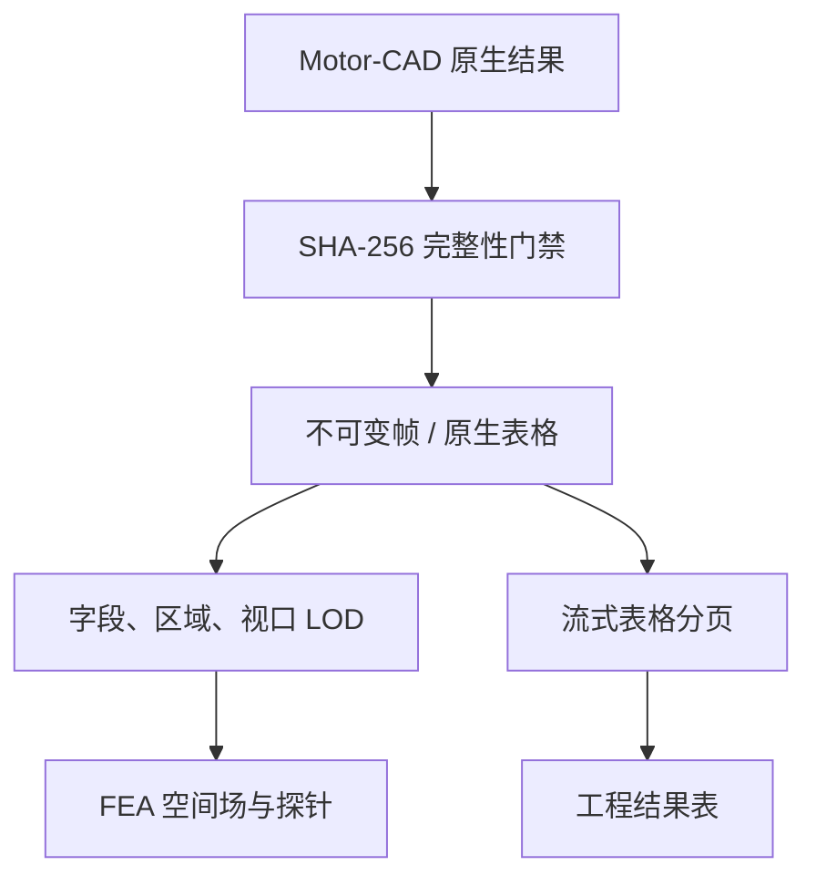

# MotorCAD Studio V0.55 深度迭代与剩余问题审计

## 1. 执行结论

V0.55 已完成本轮定义范围：原生表格改为有界内存扫描和验证分页；FEA 增加字段、区域、视口和显示预算驱动的渐进传输；结果页增加传输恢复、视口缩放和可读性下限；诊断包登记数据交付合同。全量自动化测试为 289 passed。

当前成熟度需要按三种口径表达：

| 口径 | 完成度 | 结论 |
|---|---:|---|
| V0.55 计划开发范围 | 100% | 代码、UI、合同、测试、文档和发布校验完成 |
| 17 类分析结果可视合同 | 16/17，94.1% | `lab_test_performance` 等待真实结果表映射 |
| 目标 Motor-CAD 工作站资格 | 0/17，0% | V0.55 尚未获得 Windows + 2026R1 有效 Case |

V0.55 适合进入工作站验收。批量分析和寻优仍受 `NATIVE_QUALIFIED` 门禁约束，现阶段不能把静态合同通过等同于目标工作站生产认证。

## 2. V0.54 遗留问题与 V0.55 处理结果

| 审计问题 | 工程影响 | V0.55 处理 | 状态 |
|---|---|---|---|
| 原生表格通过 `read_text()` 整体进入内存 | 百 MB 文件出现多份字符串和行对象 | CSV 采用流式完整扫描，仅保留最多 500 行结果预览 | 已完成 |
| 结果对象最多携带 20,000 行表格 | Case JSON、数据库和浏览器解析成本过高 | 默认结构化预览降至 500 行，界面首屏 200 行 | 已完成 |
| 查看表格后续数据只能下载完整文件 | 工程师无法在系统内连续检查宽表 | 增加验证分页 API，每页 1–500 行，界面支持“加载下一页” | 已完成 |
| 每个分页请求重新计算大型文件哈希 | 1 GB 文件翻页产生重复全盘扫描 | 以路径、大小、纳秒 mtime、inode 形成进程内摘要缓存；文件变化自动失效 | 已完成 |
| FEA 每次传输完整标准化帧 | 50,000 点帧产生较大网络和 JSON 解析成本 | 新增字段/区域/视口 LOD，UI 请求 12,000 点，服务端硬上限 20,000 点 | 已完成 |
| 下采样可能丢失峰值或局部区域 | 工程判断存在失真风险 | LOD 强制保留场极值、坐标极值和全部区域覆盖并返回布尔证据 | 已完成 |
| 场变量或区域改变后仍复用整帧 | 客户端承担无关字段和区域 | 字段/区域变化触发专用视图请求 | 已完成 |
| 场帧网络失败后只能显示错误 | 短暂网络问题需要离开页面重进 | 最多三次有限重试，随后显示明确原因和人工重载按钮 | 已完成 |
| 有服务端视口参数但 UI 无入口 | 大模型无法逐级查看局部区域 | 增加放大、缩小、全图按钮，视口边界参与服务端过滤 | 已完成 |
| 结果曲线可能随容器压缩得过小 | 工程图形难以阅读 | 桌面最小图高 300 px，移动端 220 px；FEA 控件最小交互高度 40 px | 已完成 |
| 常规 FEA CSV 同时保留全文、行表和点表 | 标准化峰值内存偏高 | 常规 delimited 输入改为单遍读取，移除全文和原始行列表副本 | 已完成一部分 |
| 诊断包未说明分页和 LOD 合同 | 支持人员难以确认结果经过何种数据路径 | Case 合同摘要加入 `data_delivery_contract` | 已完成 |

## 3. 当前数据流程

关键原则：LOD 和分页只改变传输规模，原生帧、原生 CSV 及其摘要继续作为权威证据。任何文件大小或 SHA-256 不一致都会返回 409，结果页停止展示受影响数据。

## 4. 官方接口证据边界

PyMotorCAD 官方 `save_fea_data(file, first_step, final_step, outputs, regions, separator)` 明确支持选择步、输出和区域，V0.55 的字段/区域渐进视图与该数据来源保持一致：<https://motorcad.docs.pyansys.com/version/stable/methods/_autosummary_FEA%20Geometry/ansys.motorcad.core.motorcad_methods.MotorCAD.save_fea_data.html>

Lab 官方 API 列表提供 `calculate_test_performance_lab()`、`export_figure_lab()` 和 `export_lab_model()`，其中 `export_figure_lab()`输出图像，公开文档没有 Test Performance 结构化结果表接口：<https://motorcad.docs.pyansys.com/version/stable/methods/_autogen_Lab.html>

通用 `export_results()` 的 Lab 选项明确对应 Lab Operating Point Solution，不能直接扩展成 Test Performance Table：<https://motorcad.docs.pyansys.com/version/stable/methods/_autosummary_General/ansys.motorcad.core.motorcad_methods.MotorCAD.export_results.html>

因此，第 17 类分析继续保持 `CONFIGURABLE`。后续应依据真实文件、字段和单位建立版本专用映射。

## 5. 功能完成度

| 子系统 | Studio 合同完成度 | 当前问题 |
|---|---:|---|
| 默认模型、多机型、模板、MOT、Revision 入口 | 100% | 各机型 No File 基线等待实机对照 |
| Geometry / Winding / Input Data | 100% | 复杂槽型和绕组刷新等待目标版本结果验证 |
| 17 类分析配置与 Run Configuration | 100% | 方法签名、模块许可证和机型兼容性等待实机 |
| 必需结果映射 | 94.1% | Lab Test Performance 表格 1 项 |
| 原生表格归档与分页 | 100% | 极端宽表的列虚拟化后续可继续优化 |
| FEA 渐进传输 | 100% | 当前为中心缩放，拖拽平移和框选待补充 |
| FEA 原始标准化 | 75% | Motor-CAD ElementsTable 路径仍需要完整文本解析；分组点仍占用源点规模内存 |
| 浏览器大场绘制 | 90% | Canvas 主线程分片；Web Worker、OffscreenCanvas、WebGL 待实现 |
| 结果错误恢复 | 95% | 进程重启后摘要缓存重新计算，超大文件首次访问仍有哈希成本 |
| 排版与可读性静态合同 | 100% | 真实浏览器像素回归尚未执行 |
| 目标工作站原生资格 | 0% | 需要真实许可证、真实求解和耐久证据 |

## 6. 仍然存在的问题

### P0：原生工作站证据缺失

这是当前距离完整稳定有限元分析的最大差距。静态 API、模拟数据和篡改测试可以验证 Studio 合同，无法证明目标 Motor-CAD 安装、许可证、RPC、求解器输出格式和长时间资源释放都符合预期。

验收要求：

- 逐机型、逐配方生成有效 Case；
- 必需结果、FEA、原生画面、消息日志和运行合同全部齐备；
- Worker 与 Motor-CAD 进程释放可验证；
- 20 次生命周期、100 Case 批量和 500 Case 耐久完成；
- 许可证不足、RPC 中断、求解器崩溃、磁盘满和文件锁故障注入完成。

### P0：原生 ElementsTable 标准化仍可能占用较多内存

常规 delimited FEA 已改为单遍输入，但官方示例使用的多表结构包含 NodesTable、RegionsTable 和 ElementsTable。当前解析器仍先载入完整文本，再建立分组点。百万级原生网格可能在渐进传输发生前消耗大量内存。

建议采用两阶段流式标准化：

1. 第一遍索引表块、节点偏移、Region 字典和 Step 边界；
2. 第二遍按 Step 读取 ElementsTable；
3. 在线维护全场范围、区域覆盖、坐标极值和有限容量采样器；
4. 每个 Step 完成后立即原子写入帧；
5. 使用 SQLite 临时索引或 mmap 保存大规模 NodeID → 坐标映射；
6. 建立 250k、1M、5M 单元的 RSS 上限测试。

### P1：浏览器绘制仍位于主线程

分片 `requestAnimationFrame` 可以避免长时间冻结，但每批 Canvas 命令仍运行在 UI 线程。建议将数据筛选、色标计算和几何变换迁移到 Web Worker；支持时使用 OffscreenCanvas。超过约 100k 可见三角形时切换 WebGL，并保持 Canvas 作为兼容路径。

### P1：像素级排版证据缺失

当前运行环境存在 Playwright 包，但没有可用浏览器二进制，因此未完成 1366×768、1920×1080、2560×1440、125% 和 150% 缩放截图回归。V0.55 已增加静态最小尺寸门禁，仍需在目标浏览器生成真实截图并进行溢出、字号、图面占比和键盘操作验收。

### P2：测试客户端依赖警告

测试套件存在 Starlette `TestClient` 关于 httpx 兼容层的弃用警告。当前不影响 289 项测试结果，依赖升级前需要建立 API 兼容分支，防止未来 Starlette/httpx 升级造成测试基础设施失效。

## 7. 后续迭代方案

### V0.56：原生大场标准化与首批实机资格

- 完成 ElementsTable 两阶段流式解析和在线采样；
- 建立 1M 单元内存预算测试；
- 完成 BPM 的 EMag、Steady Thermal、Transient Thermal、Coupled 首批有效 Case；
- 把资格矩阵从 0/17 推进到至少 4/17；
- 完成 20 次进程生命周期测试。

### V0.57：高性能交互和批量稳定性

- Web Worker / OffscreenCanvas / WebGL 分级渲染；
- 框选、拖拽平移、区域隔离和多点路径探针；
- 完成 100 Case 批量及故障注入；
- 增加帧传输耗时、首帧时间、峰值 RSS 和缓存命中率监控。

### V0.58：完整结果矩阵和生产验收

- 取得 Lab Test Performance 真实结果文件并补齐第 17 类；
- 扩展 BPMOR、IM、SYNC、SYNCREL、SRM 等机型资格；
- 完成 500 Case 耐久和许可证竞争测试；
- 完成所有目标分辨率像素回归；
- 达成配方级 `NATIVE_QUALIFIED` 后开放相应批量寻优。

## 8. V0.55 验收结果

- Pytest：289 passed；
- V0.55 发布合同：passed；
- JavaScript 语法：passed；
- Python compileall：passed；
- YAML/JSON 解析：passed；
- 10 万行表格：完整扫描、仅保留有界预览、Python 峰值内存小于 20 MiB；
- FEA LOD：场极值、坐标极值、区域覆盖、视口过滤通过；
- 篡改检测：帧、原始 FEA、原生表格和摘要缓存失效测试通过；
- 浏览器像素回归：未执行，环境缺少浏览器二进制；
- Motor-CAD 2026R1 结果验证：等待目标 Windows 工作站。

## 9. 主要变更文件

- `motorcad_studio/native_tables.py`：流式扫描、分页读取、文件指纹摘要缓存；
- `motorcad_studio/fea_views.py`：字段/区域/视口 LOD 与极值覆盖合同；
- `motorcad_studio/fea_evidence.py`：常规 delimited FEA 单遍输入；
- `motorcad_studio/main.py`：渐进 FEA API、原生表格分页和诊断交付合同；
- `motorcad_studio/static/v052.js`：LOD 加载、恢复、视口缩放和传输状态；
- `motorcad_studio/static/v054.js`：原生表格分页 UI；
- `motorcad_studio/static/styles.css`：图形最小可读高度和交互尺寸；
- `tests/test_v055_progressive_fea.py`：大表内存、分页、摘要失效、LOD 和输入合同测试。
