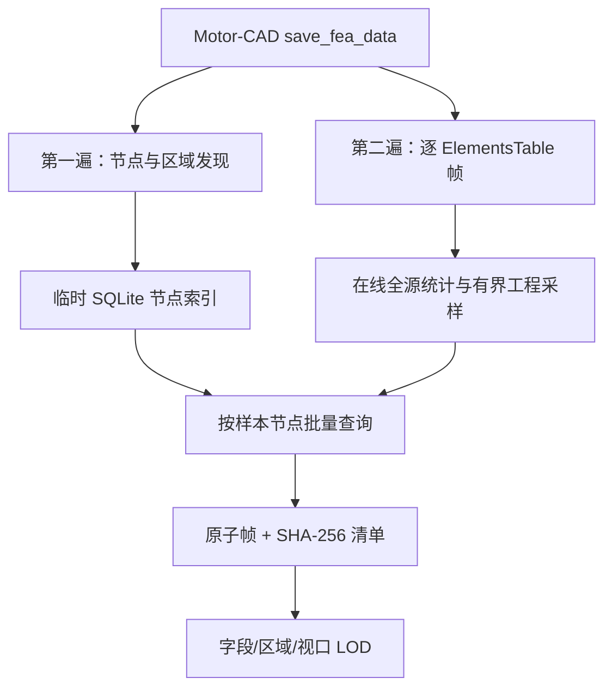

# MotorCAD Studio V0.56：原生 FEA 有界标准化与完成度审计

## 1. 本轮结论

V0.56 完成本轮定义范围：Motor-CAD 原生 `ElementsTable / NodesTable / RegionsTable` 已从全量内存解析改为两遍流式标准化，浏览器帧在固定预算内保留工程极值、空间边界和区域覆盖，节点连接通过临时磁盘索引按需装载，逐帧归档采用原子替换和 SHA-256 登记。

源码实现完成度为 100%。该数字只覆盖本轮功能、接口、诊断和自动回归。目标 Windows + Motor-CAD 2026R1 的真实求解资格仍为 0/17；当前环境没有 Motor-CAD 许可证、真实 MOT 模型和 Windows GUI，不能用合成数据替代原生结果验证。

## 2. V0.55 遗留问题与 V0.56 处理

| 问题 | 工程风险 | V0.56 处理 | 状态 |
|---|---|---|---|
| 原生多表文件先整体读取为字符串 | 百万单元时产生大对象峰值 | 原生入口直接分派两遍文件扫描 | 完成 |
| 全量 Element row、point、field list 同时驻留 | 同一数据形成多份 Python 对象 | 在线构造点、统计并立即进入有界采样器 | 完成 |
| NodesTable 全量进入字典 | 大网格节点数直接推高进程内存 | 临时 SQLite `WITHOUT ROWID` 节点索引，按入选单元批量查询 | 完成 |
| 唯一坐标使用 Python set | 坐标规模随源单元线性增长 | SQLite 复合主键计算精确唯一坐标数 | 完成 |
| 抽样依赖完整 frame list | 只有整帧读取后才能保留极值 | 在线保留 X/Y 边界、各场 min/max、每区域首点和稳定哈希样本 | 完成 |
| 帧直接写目标 JSON | 中断可能留下半写文件 | `.tmp` 写完后原子替换，登记大小与 SHA-256 | 完成 |
| 未传 outputs 时可能误把单位行当表头 | 字段与坐标识别失败 | 以 TriIndex + Node1/2/3 结构定位结果表头并自动推断 outputs | 完成 |
| 原生解析固定逗号 | 自定义 separator 后退化为 RAW_ONLY | 自动识别逗号、分号、Tab、竖线 | 完成 |
| 操作者看不到标准化资源路径 | 难以判断超大场处理方式 | 结果页显示两遍流式标准化、磁盘节点索引；诊断公开 I/O 合同 | 完成 |

## 3. 当前数据路径

源文件仍是最高权威证据。标准化帧是可验证的派生视图；LOD 继续从已登记帧生成，返回源点数、筛选点数、传输点数和极值/区域保留证据。

## 4. 测试与性能证据

| 验证项 | 结果 |
|---|---:|
| 全量 pytest | 295 passed |
| 新增 V0.56 测试 | 6 passed |
| 合成原生单元 | 100,000 |
| 原生帧 | 2 |
| 每帧保留预算 | 400 |
| 总显示点 | 800 |
| Python tracemalloc 峰值 | 约 0.64 MiB |
| 标准化耗时 | 约 11.2 s |
| 原始测试文件 | 约 2.92 MiB |
| Python 峰值门禁 | < 40 MiB |

上述测量来自 Linux 合成文件，SQLite C 层内存、操作系统页缓存和真实 Motor-CAD 导出开销未计入 `tracemalloc`。Windows 实机验收仍需同时采集进程 RSS、磁盘吞吐、文件大小、单元/节点规模和许可证占用。

## 5. 分部分完成度

| 部分 | Studio 实现 | 原生结果验证 | 判断 |
|---|---:|---:|---|
| 默认模型与模型优先入口 | 100% | 0% | 可从默认 BPM、机型、模板、MOT、Revision 开始；各来源仍需实机逐项验证 |
| Geometry / Winding / Input Data 工作区 | 100%（当前注册范围） | 0% | 具备七种设计视图、参数与版本流；未声称覆盖 Motor-CAD 所有变量 |
| 17 类分析定义与不可变 Run Configuration | 100% | 0/17 | 16 类 RESULT_VISIBLE，`lab_test_performance` 仍为 CONFIGURABLE |
| 原生 FEA 导出与资格门 | 100% | 0/17 | required FEA 缺失会阻止资格 |
| 原生多表流式标准化 | 100% | 0% | 本轮合成与兼容回归通过，真实版本格式待验收 |
| 场可视化与帧完整性 | 100%（当前合同） | 0% | 字段/区域/色标/探测/LOD/缩放/重试齐备 |
| 自动结果提取 | 100%（注册输出） | 0/17 | 必需结果缺失或数值无效会阻止资格 |
| 批量分析与寻优准入 | 100%（控制面） | 0% | 只允许完整且 VALID 的真实 Case 进入工程寻优 |
| Windows 运行时与许可证耐久 | 已有合同与诊断 | 0% | 需要 20/100/500 Case 真实运行 |

## 6. 当前仍存在的问题

### P0：真实 Motor-CAD 资格仍为空

当前没有任何配方达到 `NATIVE_QUALIFIED`。需要在目标工作站逐配方保存：Motor-CAD/PyMotorCAD 版本、EXE 指纹、源 MOT 哈希、调用方法、原生日志、必需结果、FEA 清单、帧哈希、进程释放和失败证据。此前的离线完成度不能替代这一步。

### P0：`lab_test_performance` 仍缺真实结果映射

17 类配方中 16 类具备结构化结果可视合同。Lab Test Performance 只能保持 CONFIGURABLE，直到目标版本回读真实表名、列名、单位和工况轴，并为缺失/非有限值建立硬门禁。

### P1：常规 delimited FEA 仍按 Step 聚合内存

V0.56 解决了 Motor-CAD 原生多表主路径。普通表头 CSV 的输入读取已是单遍，但转换后仍按 Step 保存 point list，并维护全量字段值和坐标集合。超大普通 CSV 仍可能占用较多内存。建议 V0.57 使用按 Step 磁盘 spool 或统一 SQLite frame store，使两种输入共享在线采样器。

### P1：当前场图属于求解后渐进展示

界面能够按帧渐进传输、恢复和缩放；原生 `save_fea_data` 通常在求解完成后导出。当前证据不支持宣称求解迭代过程中实时刷新云图。若目标 Motor-CAD 版本允许安全读取中间 Step，应新增只读快照队列、稳定文件判定和 Solver Session 隔离，避免读写竞争。

### P1：矢量、等势线和单位权威仍不完整

当前可显示 B、Bx、By、Pt、J、JEddy、SVM 和位移等已注册场。真实等势线、矢量箭头和涡流单位仍需目标版本字段说明与数值验证；系统保持 `equipotential_lines=false`，未知单位显示为原生单位待确认。

### P1：浏览器像素级验收缺失

静态可读性合同、最小高度和响应式规则已覆盖，当前容器没有可用浏览器二进制，未执行 Windows 高 DPI、中文字体、超宽/窄屏、十万级交互的截图差异测试。

## 7. 后续迭代建议

| 版本 | 目标 | 验收门 |
|---|---|---|
| V0.57 | 普通 delimited FEA 磁盘分帧、统一在线采样；字段单位注册表 | 100 万点普通 CSV 峰值内存门禁、跨 Step 乱序测试 |
| V0.58 | 矢量/等势线真实可视化、Web Worker/OffscreenCanvas 绘制 | 与 Motor-CAD 同一 Case 数值探针和截图差异阈值 |
| V0.59 | Windows 2026R1 逐配方资格、Lab Performance 映射 | 17/17 RESULT_VISIBLE，逐配方完整证据包 |
| V0.60 | 合格 Case 批量分析、敏感性与寻优闭环 | 20/100/500 Case 耐久、许可证释放、失败恢复、可重复 Pareto 结果 |

V0.57 应先处理普通 delimited FEA 的内存一致性；V0.59 的真实资格可并行在 Windows 工作站执行。完成这两项后，系统才具备将“完整稳定有限元分析与自动结果提取”扩展到大批量寻优的可靠基础。

## 8. 官方接口依据

- PyMotorCAD `save_fea_data(file, first_step, final_step, outputs, regions, separator)` 用于保存当前 FEA 解的原始数据，并支持 transient Step、输出字段、区域和分隔符配置。
- PyMotorCAD Mechanical Stress 示例展示机械求解后读取最大应力与安全系数的自动化模式。

V0.56 对文件结构的兼容逻辑仍需用目标 Motor-CAD 真实导出来验证；接口文档支持导出能力，不等同于对每个版本的内部多表排列作出保证。
