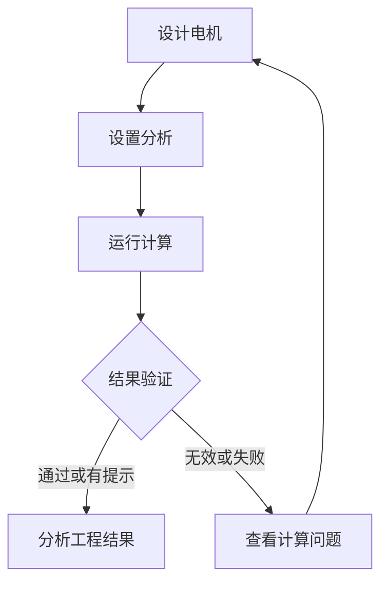

# MotorCAD Studio V0.59 工程师导航、可用性与结果可靠性审计

## 1. 结论与验收边界

V0.59 已完成 Studio 代码范围内的工程流程收口：模型、分析、求解和结果不再依赖多套重复导航；项目状态以“是否存在可用于工程判断的 Case”为准；结果页优先落到可用数据；终止、关闭和离开等高风险操作均有保护。

自动化验收为 **320 passed**。这证明 Studio 的数据库状态、API 合同、前端行为和静态可读性约束满足本版本合同。Windows + Motor-CAD 2026R1 的真实求解、许可证、原生有限元导出、屏幕抓取和长时间稳定性仍属于目标工作站验收范围；未取得真实证据的模板/配方不会标记为 `NATIVE_QUALIFIED`。

## 2. 当前工程流程

四个主阶段持续显示；每个阶段给出完成条件。求解结束后，VALID/WARNING Case 进入结果中心，INVALID/FAILED Case 进入计算问题，避免把“执行完成”误当成“结果可用”。

## 3. 逐项问题、修复和完成度

| 编号 | 发现的问题 | V0.59 处理 | Studio 完成度 | 仍需外部验收 |
|---|---|---|---:|---|
| 1 | 项目导航、四步流程和上下文条重复，占用首屏 | 合并为紧凑四阶段状态条；当前阶段、完成条件与下一步集中显示 | 100% | Windows DPI 视觉验收 |
| 2 | “Task 完成”可能被误读为“结果可用” | 项目状态聚合 usable/invalid/failed Case；只有 SUCCEEDED/CACHED + VALID/WARNING 才进入结果 | 100% | 真实配方结果验证 |
| 3 | 结果中心默认打开第一条历史记录，可能落到失败 Case | 默认选择最近具有 usable Case 的任务，再选择 VALID/WARNING Case | 100% | 大型历史库性能验收 |
| 4 | 结果侧栏列出无数据模块，用户点击后只看到空白 | 只显示实际可用模块；未生成内容折叠为数量与返回分析设置提示 | 100% | 17 类配方逐项实机映射 |
| 5 | 停止与强制终止容易误触或重复提交 | 页内确认、危险等级提示、按钮等待态与禁用保护 | 100% | Motor-CAD 中断恢复验收 |
| 6 | 任务完成后实时连接仍可能重连，状态不清晰 | 初始终态不建立 SSE；终态快照或 TASK_FINISHED 主动关闭连接并显示交接动作 | 100% | 长时间断网/恢复验收 |
| 7 | 几何、绕组、槽内和 FEA 画布偏小，标签低于阅读下限 | 主工程画布最小 500 px，FEA 最小 520 px，大模板预览 340–520 px；关键说明提升到 11–12 px | 100% | 100%/125%/150% DPI 截图验收 |
| 8 | 结果输入快照仍可能显示嵌套 JSON | 递归展开为工程参数、工况、材料和求解设置表；布尔与空值工程化表达 | 100% | 特殊第三方材料结构样本 |
| 9 | 参数侧栏有未保存修改时可直接关闭 | 输入变更标脏；关闭、背景点击和页面离开均触发保护 | 100% | 浏览器组合键人工验收 |
| 10 | 路由切换后键盘和读屏用户难以确认页面 | 增加 `aria-live` 页面播报，并把焦点移动到活动页标题 | 100% | NVDA/Windows Narrator 验收 |

## 4. 对此前十项要求的复查

| 用户要求 | 当前状态 | 证据/说明 |
|---|---|---|
| Motor-CAD 九类电机模板体系 | 已完成 | BPM、BPMOR、IM、IM1PH、SYNC、SYNCREL、SRM、PMDC、CLAW；支持默认模型、模板、MOT 和 Revision 来源 |
| 说明面向工程师 | 已完成 | 分析卡片给出用途、工况、输出和完成后可查看内容；内部术语默认下沉 |
| 求解类型对齐并可配置 | 已完成 | 电磁、热、耦合、Lab、机械共 17 类配方，字段由配方 Schema 驱动 |
| 绕组线不侵入转子、槽内导体不重合 | 已完成 | 端部路径约束在绕组环带；导体分别裁剪在左右槽腔并执行间距约束 |
| 原生证据与 JSON 不直接占据普通界面 | 已完成 | 普通界面展示工程结论；诊断包和高级日志保留原始证据；结果快照已结构化 |
| 参数输入面板工程化 | 已完成 | 显示物理含义、单位、范围、影响、当前值与变更状态，只保存有效变更 |
| 结果查看流程清晰 | 已完成 | 自动选择可用任务/Case，显示可用模块，质量未通过时进入问题处理 |
| 日志问题分析 | 已完成 | 启动会话、Task、Case、Stage、PID、Request/Trace 可关联；诊断包按任务导出 |
| GUI 空间与可读性 | 已完成代码收口 | 响应式布局、画布尺寸、字号、焦点、空状态、加载态、深色模式均有合同 |
| 有限元步骤与输入输出监控 | 已完成 | 模型输入、有限元求解、空间场输出、结果提取、结果验证、归档六阶段监控 |

## 5. 可靠性策略

### 5.1 状态真值

- `Task.status` 只描述批次执行进度。
- `Case.execution_status` 描述求解是否完成。
- `Case.quality_status` 描述结果是否适合工程判断。
- `usable_case = execution_status ∈ {SUCCEEDED, CACHED} ∧ quality_status ∈ {VALID, WARNING}`。

项目首页、任务列表、结果默认选择和求解结束交接统一使用该定义。

### 5.2 并发与过期响应

- Task/Case 结果加载继续使用请求 token，过期响应不能覆盖最新选择。
- 结束态任务不再建立或保持实时事件连接。
- 终止按钮在请求期间禁用，防止重复发出控制请求。
- 参数侧栏通过脏状态阻止无提示丢失。

### 5.3 证据边界

普通工程界面只显示结论、指标、曲线、空间场和可执行建议。JSON、MOT、哈希、原始日志、PID、RPC 和完整原生文件继续保存在诊断包/高级工具中，便于开发与质量追溯。

## 6. 自动化验证

- `pytest`: 320 passed。
- JavaScript: 所有静态脚本通过 `node --check`。
- Python: `compileall` 通过。
- JSON/YAML: 发布清单与配置解析通过。
- 新增 V0.59 合同覆盖：质量感知项目引导、离线历史结果访问、可用结果自动选择、结果模块过滤、危险操作确认、终态 SSE 关闭、未保存参数保护、结构化输入快照、工程画布与可访问性。

## 7. 尚未宣称完成的外部工作

1. 在目标 Windows + Motor-CAD 2026R1 工作站对 17 类配方逐项执行真实结果验证。
2. 对九类机型的企业 MOT 母版执行参数回读、绕组再生成、有限元场和结果提取资格测试。
3. 在 100%/125%/150% DPI、1366×768 至 4K 分辨率执行截图验收。
4. 执行 20/100/500 Case 许可证竞争、内存准入、进程回收、RPC 断开和恢复耐久测试。
5. 后续将历史版本前端覆盖层合并为模块化组件，降低长期维护成本；本版本通过加载顺序、签名防抖和全量回归保证当前行为一致。

## 8. 推荐实机验收顺序

1. 绑定目标 `Motor-CAD.exe` 并完成浅检查、深检查和 Worker 能力探测。
2. 从默认 BPM 运行一条额定点 EMag 基线，确认参数回读、求解、结果提取和 FEA 导出。
3. 验证结果中心自动落到可用 Case，并检查磁密、矢量势、转矩、损耗和波形。
4. 依次扩展 Thermal、Coupled、Lab、Mechanical，再扩展到其余机型。
5. 完成 DPI 截图与 20/100/500 Case 耐久合同，记录为模板/配方资格证据。
